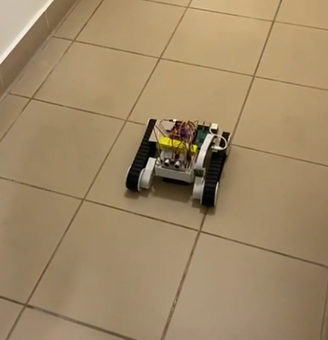
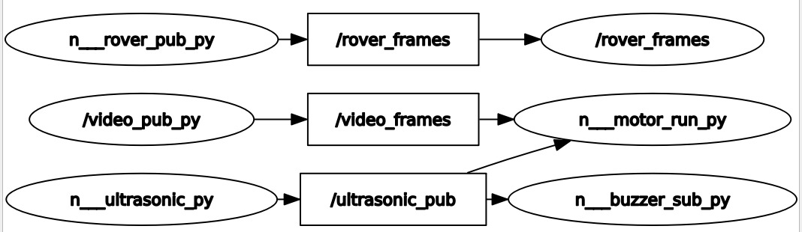

# Head-Controlled Rover

Done by Ahmad Serhal, Jad Farhat, Jana Kerbaj, and Majd Al Kontar

## Description
This project enables quadriplegic patients to navigate a wheelchair by using only their head movement.
A prototype of the functionality is implemented and demonstrated using a Raspberry Pi 3 Model B and a Rover 5.
The current commands the patient can give are moving forward, moving backward, turning left, and turning right.
The Rover is also equipped with an ultrasonic sensor which acts as a safety mechanism that stops the Rover and triggers a buzzer in case an obstacle is detected.
For this prototype the user can control the rover by sitting infront of the PC and moving their head to control the Rover while viewing the camera feed the Rover is sending to the PC. Also, a sign was added to activate the steering process. This sign is blinking twice fast in 2 seconds.

## Hardware Connections

## ROS RQT-Graph

The `video_pub_py` node is running on the PC and computates the action that the user wants to execute and sends this command to `n__motor_run_py` which is running on the rover.
The `n__ultrasonic_py` node is running on the Rover and publishes to the motor node and the buzzer node.
The `n__rover_pub_py` node sends the video frames from the Rover to the PC `rover_frames`.

## Branches

### RPI
The codes running on the Raspberry Pi

### PC
The codes running on the PC

### Web-interface

#### Features
* Sends the patients vitals (heart beat - pulse) to a web interface
* Displays the stream from the Rover and PC
* Shows real-time patient vitals
* Tabulates the vitals received with timestamps
* Shows the messages conveyed by the patient as alerts
